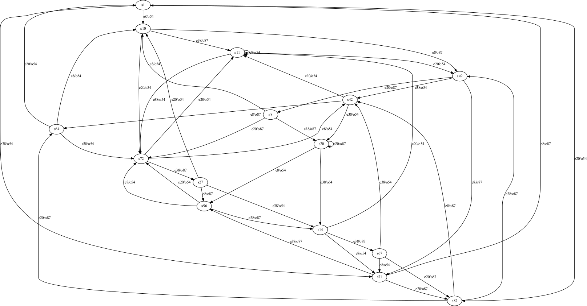
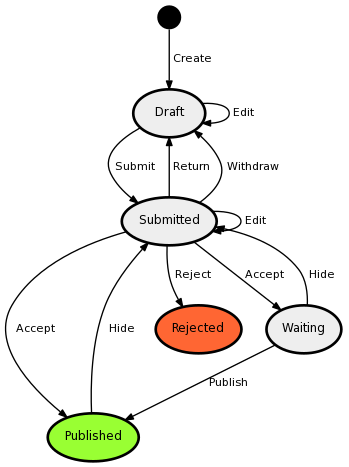

# Testování stavového automatu
Skupina: **10**  
Řešitelé: **Stanke Michal**, **Timr Marek**, **Voříšek Lukáš**

## Zadání úlohy Testování stavového automatu
Navrhněte charakterizační množinu pro následující konečný deterministický automat. Stavy jsou identifikovány prefixem "s", události prefixem "e",
výstupní symboly prefixem "o". Nedosažitelné části automatu identifikujte jako chybu a při konstrukci charakterizační množiny nedosažitelné stavy
neuvažujte. Jestliže přechod z nějakého stavu není pro danou událost určen, zůstává automat ve stejném stavu a na výstup pošle předdefinovaný
výstupní symbol (default output).

<pre style="font-size: .8em">
entry node: s96
exit  node: s49
default output: o54
transition: s67 -> e38/o54 -> s42
transition: s72 -> e20/o54 -> s11
transition: s71 -> e8/o87 -> s1
transition: s27 -> e38/o54 -> s14
transition: s71 -> e38/o87 -> s96
transition: s11 -> e38/o54 -> s72
transition: s42 -> e20/o54 -> s11
transition: s8 -> e8/o54 -> s10
transition: s14 -> e20/o54 -> s11
transition: s96 -> e38/o87 -> s14
transition: s8 -> e20/o87 -> s72
transition: s1 -> e8/o54 -> s10
transition: s11 -> e8/o54 -> s11
transition: s10 -> e8/o87 -> s49
transition: s11 -> e20/o54 -> s49
transition: s10 -> e38/o87 -> s11
transition: s42 -> e38/o54 -> s20
transition: s87 -> e20/o87 -> s64
transition: s49 -> e38/o54 -> s42
transition: s49 -> e20/o87 -> s8
transition: s1 -> e20/o54 -> s87
transition: s72 -> e8/o54 -> s42
transition: s27 -> e20/o54 -> s10
transition: s27 -> e8/o87 -> s96
transition: s14 -> e38/o87 -> s67
transition: s49 -> e8/o87 -> s71
transition: s67 -> e8/o54 -> s71
transition: s67 -> e20/o87 -> s87
transition: s64 -> e38/o54 -> s72
transition: s71 -> e20/o87 -> s87
transition: s72 -> e38/o87 -> s27
transition: s87 -> e38/o87 -> s49
transition: s42 -> e8/o87 -> s64
transition: s96 -> e8/o54 -> s72
transition: s87 -> e8/o87 -> s42
transition: s20 -> e38/o54 -> s14
transition: s10 -> e20/o54 -> s72
transition: s64 -> e20/o54 -> s1
transition: s8 -> e38/o87 -> s20
transition: s64 -> e8/o54 -> s10
transition: s1 -> e38/o54 -> s71
transition: s96 -> e20/o54 -> s72
transition: s20 -> e8/o54 -> s96
transition: s14 -> e8/o54 -> s71
transition: s20 -> e20/o87 -> s20
</pre>

 

  obrázek 1 - zadaný graf

## Charakterizační množina
<pre>
W = {(e08 e08), (e08 e20), (e08 e38), (e08), (e20 e08), (e20), (e38)}
</pre>

<pre>
(s01,s08): e20
(s01,s10): e08
(s01,s11): e08e08
(s01,s14): e38
(s01,s20): e20
(s01,s27): e08
(s01,s42): e08
(s01,s49): e08
(s01,s64): e20e08
(s01,s67): e20
(s01,s71): e08
(s01,s72): e38
(s01,s87): e08
(s01,s96): e38
(s08,s10): e08
(s08,s11): e20
</pre>

<pre>
(s08,s14): e20
(s08,s20): e38
(s08,s27): e08
(s08,s42): e08
(s08,s49): e08
(s08,s64): e20
(s08,s67): e38
(s08,s71): e08
(s08,s72): e20
(s08,s87): e08
(s08,s96): e20
(s10,s11): e08
(s10,s14): e08
(s10,s20): e08
(s10,s27): e38
(s10,s42): e38
</pre>

<pre>
(s10,s49): e20
(s10,s64): e08
(s10,s67): e08
(s10,s71): e20
(s10,s72): e08
(s10,s87): e20
(s10,s96): e08
(s11,s14): e38
(s11,s20): e20
(s11,s27): e08
(s11,s42): e08
(s11,s49): e08
(s11,s64): e08e08
(s11,s67): e20
(s11,s71): e08
(s11,s72): e38
</pre>

<pre>
(s11,s87): e08
(s11,s96): e38
(s14,s20): e20
(s14,s27): e08
(s14,s42): e08
(s14,s49): e08
(s14,s64): e38
(s14,s67): e20
(s14,s71): e08
(s14,s72): e08e20
(s14,s87): e08
(s14,s96): e08e08
(s20,s27): e08
(s20,s42): e08
(s20,s49): e08
(s20,s64): e20
(s20,s67): e08e08
(s20,s71): e08
(s20,s72): e20
</pre>

<pre>
(s20,s87): e08
(s20,s96): e20
(s27,s42): e08e38
(s27,s49): e20
(s27,s64): e08
(s27,s67): e08
(s27,s71): e20
(s27,s72): e08
(s27,s87): e20
(s27,s96): e08
(s42,s49): e20
(s42,s64): e08
(s42,s67): e08
(s42,s71): e20
(s42,s72): e08
(s42,s87): e20
(s42,s96): e08
(s49,s64): e08
(s49,s67): e08
</pre>

<pre>
(s49,s71): e38
(s49,s72): e08
(s49,s87): e38
(s49,s96): e08
(s64,s67): e20
(s64,s71): e08
(s64,s72): e38
(s64,s87): e08
(s64,s96): e38
(s67,s71): e08
(s67,s72): e20
(s67,s87): e08
(s67,s96): e20
(s71,s72): e08
(s71,s87): e08e08
(s71,s96): e08
(s72,s87): e08
(s72,s96): e08e08
(s87,s96): e08
</pre>

## Output traces

<pre>
s01 -> (e08): o54
s01 -> (e20): o54
s01 -> (e20 e08): o54,o87
s01 -> (e08 e20): o54,o54
s01 -> (e08 e38): o54,o87
s01 -> (e38): o54
s01 -> (e08 e08): o54,o87
s08 -> (e08): o54
s08 -> (e20): o87
s08 -> (e20 e08): o87,o54
s08 -> (e08 e20): o54,o54
s08 -> (e08 e38): o54,o87
s08 -> (e38): o87
s08 -> (e08 e08): o54,o87
s10 -> (e08): o87
s10 -> (e20): o54
s10 -> (e20 e08): o54,o54
s10 -> (e08 e20): o87,o87
s10 -> (e08 e38): o87,o54
s10 -> (e38): o87
s10 -> (e08 e08): o87,o87
s11 -> (e08): o54
s11 -> (e20): o54
s11 -> (e20 e08): o54,o87
</pre>

<pre>
s11 -> (e08 e20): o54,o54
s11 -> (e08 e38): o54,o54
s11 -> (e38): o54
s11 -> (e08 e08): o54,o54
s14 -> (e08): o54
s14 -> (e20): o54
s14 -> (e20 e08): o54,o54
s14 -> (e08 e20): o54,o87
s14 -> (e08 e38): o54,o87
s14 -> (e38): o87
s14 -> (e08 e08): o54,o87
s20 -> (e08): o54
s20 -> (e20): o87
s20 -> (e20 e08): o87,o54
s20 -> (e08 e20): o54,o54
s20 -> (e08 e38): o54,o87
s20 -> (e38): o54
s20 -> (e08 e08): o54,o54
s27 -> (e08): o87
s27 -> (e20): o54
s27 -> (e20 e08): o54,o87
s27 -> (e08 e20): o87,o54
s27 -> (e08 e38): o87,o87
s27 -> (e38): o54
</pre>

<pre>
s27 -> (e08 e08): o87,o54
s42 -> (e08): o87
s42 -> (e20): o54
s42 -> (e20 e08): o54,o54
s42 -> (e08 e20): o87,o54
s42 -> (e08 e38): o87,o54
s42 -> (e38): o54
s42 -> (e08 e08): o87,o54
s49 -> (e08): o87
s49 -> (e20): o87
s49 -> (e20 e08): o87,o54
s49 -> (e08 e20): o87,o87
s49 -> (e08 e38): o87,o87
s49 -> (e38): o54
s49 -> (e08 e08): o87,o87
s64 -> (e08): o54
s64 -> (e20): o54
s64 -> (e20 e08): o54,o54
s64 -> (e08 e20): o54,o54
s64 -> (e08 e38): o54,o87
s64 -> (e38): o54
s64 -> (e08 e08): o54,o87
s67 -> (e08): o54
s67 -> (e20): o87
</pre>

<pre>
s67 -> (e20 e08): o87,o87
s67 -> (e08 e20): o54,o87
s67 -> (e08 e38): o54,o87
s67 -> (e38): o54
s67 -> (e08 e08): o54,o87
s71 -> (e08): o87
s71 -> (e20): o87
s71 -> (e20 e08): o87,o87
s71 -> (e08 e20): o87,o54
s71 -> (e08 e38): o87,o54
s71 -> (e38): o87
</pre>

<pre>
s71 -> (e08 e08): o87,o54
s72 -> (e08): o54
s72 -> (e20): o54
s72 -> (e20 e08): o54,o54
s72 -> (e08 e20): o54,o54
s72 -> (e08 e38): o54,o54
s72 -> (e38): o87
s72 -> (e08 e08): o54,o87
s87 -> (e08): o87
s87 -> (e20): o87
s87 -> (e20 e08): o87,o54
</pre>

<pre>
s87 -> (e08 e20): o87,o54
s87 -> (e08 e38): o87,o54
s87 -> (e38): o87
s87 -> (e08 e08): o87,o87
s96 -> (e08): o54
s96 -> (e20): o54
s96 -> (e20 e08): o54,o54
s96 -> (e08 e20): o54,o54
s96 -> (e08 e38): o54,o87
s96 -> (e38): o87
s96 -> (e08 e08): o54,o54
</pre>

## State cover set
<pre>
{(e08 e08 e08), (e08 e08 e38), (e08 e08), (e08 e20 e20 e20), (e08 e20 e20), (e08 e20), (e08 e38 e20), (e08 e38), (e08), (e38 e08 e08), (e38 e08 e20), (e38 e08), (e38 e38), (e38)}
</pre>

## Transition cover set
<pre>
{(e08 e08 e08 e08), (e08 e08 e08 e20), (e08 e08 e08 e38), (e08 e08 e08), (e08 e08 e20), (e08 e08 e38 e08), (e08 e08 e38 e20), (e08 e08 e38 e38), (e08 e08 e38), (e08 e08), (e08 e20 e08), (e08 e20 e20 e08), (e08 e20 e20 e20 e08), (e08 e20 e20 e20 e20), (e08 e20 e20 e20 e38), (e08 e20 e20 e20), (e08 e20 e20 e38), (e08 e20 e20), (e08 e20 e38), (e08 e20), (e08 e38 e08), (e08 e38 e20 e08), (e08 e38 e20 e20), (e08 e38 e20 e38), (e08 e38 e20), (e08 e38 e38), (e08 e38), (e08), (e20), (e38 e08 e08 e08), (e38 e08 e08 e20), (e38 e08 e08 e38), (e38 e08 e08), (e38 e08 e20 e08), (e38 e08 e20 e20), (e38 e08 e20 e38), (e38 e08 e20), (e38 e08 e38), (e38 e08), (e38 e20), (e38 e38 e08), (e38 e38 e20), (e38 e38 e38), (e38 e38), (e38)}
</pre>

## Úloha Články redakčního systému

  
  obrázek 2 - zadaný graf stavů článku v redakčním systému

## Použitý algoritmus
Pro řešení úlohy jsme v jazyce Scala implementovali algoritmus z přednášky (chapter-3.ppt) s využitím k-ekvivalencí. Zdrojové kódy jsou příloženy ke zprávě.
