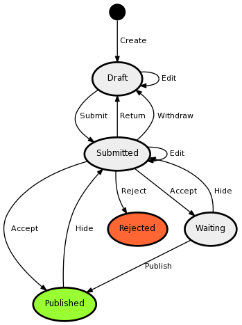
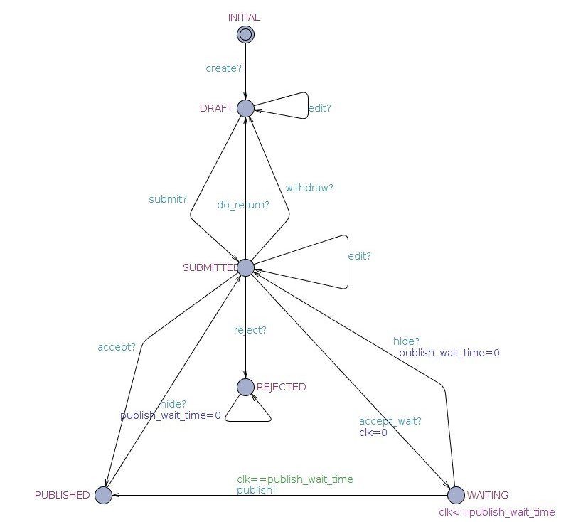
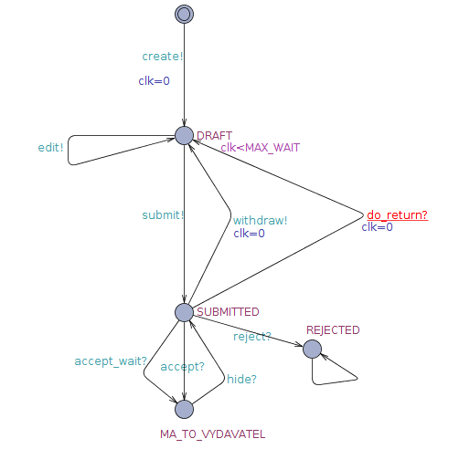
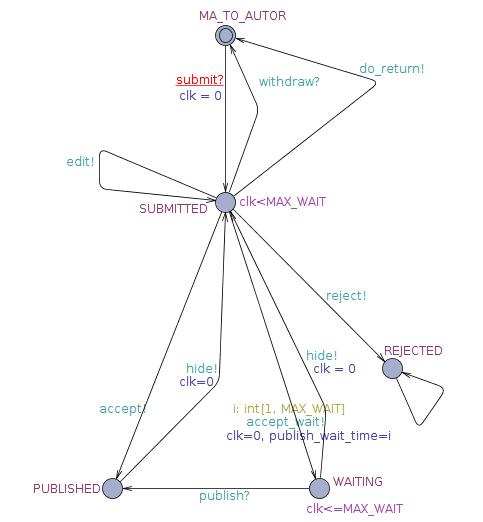

# Testování stavového automatu
Skupina: **10**  
Řešitelé: **Stanke Michal**, **Timr Marek**, **Voříšek Lukáš**

## Zadání semestrální úlohy
 1. Z aplikace získejte definici stavového automatu (jednu entitu dle vašeho téma) a importujte ji do Uppallu.
 2. Vymodelujte v Uppallu další entity, například uživatele, tak aby byly použity alespoň dvoje hodiny.
 3. Simulujte chování systému a dokažte nějaké zajímavé vlastnosti.

Naše skupina zpracovala úlohu 1, tedy [Články redakčního systému](http://cascade-examples.frozen-doe.net/admin/doc/smalldb/article). V této úloze jsme vytvořili model, který reprezentuje stavy pro *článek*, *autora* a *nakladatelství*, kde každá z entit má vlastní hodiny `clk` (body 1 a 2 ze zadání). Na tomto modelu jsme simulovali průchod tvorby článku od autora až po vydání.

Znázornění automatu úlohy 1, ze kterého jsme vycházeli:

	

## Automaty
V této sekci budou popsány jednotlivé entity. Tedy lokace a přechody, které reprezentují tyto entity.

### Článek
<table style="width: 60%; float: right;">
	<tbody>
		<tr><td style="text-align: center;">
			
		</td></tr>
		<tr><td style="text-align: center;">
			Obrázek 1: Stav článku
		</td></tr>
	</tbody>
</tbale>

Lokace tohoto automatu představují stavy, ve kterých se může článek nacházet během svého života.

Počáteční lokací je `INITAL`, ve které žádný článek ještě neexistuje. V této lokaci čeká na příjem signálu `create`. Přijetí tohoto signálu dovolí článku přejít do stavu `DRAFT`, tedy konceptu. Článek v tomto stavu je rozpracovaný autorem.

Jakákoliv editace článku (událost `edit`) zanechá článek ve stavu konceptu. Přechod do jiného stavu způsobí až autor článku tím, že se jej pokusí odevzdat redakci (akce `submit`), kdy se článek považuje za odevzdaný `SUBMITTED`.

Odevzdaný článek (`SUBMITTED`) je následně editován vydavatelem. Tato editace je však časově omezena. Následně je článek redakcí buď přijat (hrana `accept?`) nebo odmítnut (hrana `reject?`).

Článek, který je jednou odmítnut, je odmítnut již napořád. Naopak publikovaný článek (ve stavu `PUBLISHED`) může být stažen zpět do redakce (stavu `SUBMITTED`) pomocí hrany `hide?`, která je řízena rozhodnutím vydavatele.

### Autor
<table style="width: 60%; float: right;">
	<tbody>
		<tr><td style="text-align: center;">
			
		</td></tr>
		<tr><td style="text-align: center;">
			Obrázek 2: Autor
		</td></tr>
	</tbody>
</tbale>

Autor začíná ve svém počáteční lokaci a s přechodem do lokace `DRAFT` vyvolá zprávu `create`, která informuje ostatní automaty o vytvoření článku. Tedy v předchozím automatu dojde k přechodu na hraně `create?`.

V lokaci `DRAFT` může dojít ke spuštění dvou akcí (dvou hran) a to buď hrany `edit!` a nebo `submit!`. Akce `edit!`, která informuje o tom, že autor upravil článek a nebo akce `submit!`, která informuje o tom, že autor odevzdal článek redakci.

V odevzdaném stavu (`SUBMITTED`) již nemůže autor na článku pracovat. Všechny přechody zrcadlí rozhodnutí ostatních automatů tedy akceptaci článku, jeho odmítnutí a nebo čekání.

### Vydavatel
<table style="width: 60%; float: right;">
	<tbody>
		<tr><td style="text-align: center;">
			
		</td></tr>
		<tr><td style="text-align: center;">
			Obrázek 3: Vydavatel
		</td></tr>
	</tbody>
</tbale>

Úvodní lokací pro vydavatele je uzel `MA_TO_AUTOR`. Jedinou přechodovou hranou z tohoto uzlu je reakce na zprávu `submit?`, která je vyslána autorem.

V odevzdaném stavu (`SUBMITTED`) může vydavatel článek editovat, odmítnout, akceptovat a nebo započít nádhodně dlouhé čekaní.

Publikovaný článek (`PUBLISHED`) může být redakcí odvolán (`hide!`).

Pokud redakce článek jednou odmítne (`reject!`) zůstane již navždy odmítnutý.

## Ověřování
K ověřování tvrzení jsme využili Verifier, který je dostupný v UPPAALU.

<ul>
	<li>
		<strong>E&lt;&gt; deadlock</strong> 
		Ověřuje zda může dojít k deadlocku.
		Mělo by vyjít FALSE.
	</li>
	<li>
		<strong>A[] not deadlock</strong> 
		Říká, že nikdy nenastane deadlock.
	</li>
	<li>
		<strong>A[] nakladatelstvi.MA_TO_AUTOR imply (clanek.DRAFT or clanek.SUBMITTED or clanek.INITIAL)</strong> 
		Pokud má článek autor, tak musí být koncept (DRAFT), odevzdaný (SUBMITTED) a nebo v počátečním stavu (INITIAL).
	</li>
	<li>
		<strong>A[] autor.MA_TO_VYDAVATEL imply (clanek.PUBLISHED or clanek.WAITING)</strong> 
		Pokud má článek vydavatel, tak musí být publikovaný nebo čekající.
	</li>
	<li>
		<strong>A[] nakladatelstvi.PUBLISHED imply (autor.MA_TO_VYDAVATEL and clanek.PUBLISHED)</strong> 
		Článek je publikovaný. Má ho tedy vydavatel a je publikován.
	</li>
	<li>
		<strong>A[] clanek.PUBLISHED imply (autor.MA_TO_VYDAVATEL and nakladatelstvi.PUBLISHED)</strong> 
		Článek je publikovaný (druhé ověření). Je publikovaný pro nakladatelství a má jej vydavatel.
	</li>
	<li>
		<strong>A[] nakladatelstvi.WAITING imply (autor.MA_TO_VYDAVATEL and clanek.WAITING)</strong> 
		Článek je pro vydavatele ve stavu čekání, je tedy u vydavatele a ve stavu čekání.
	</li>
	<li>
		<strong>A[] clanek.WAITING imply (autor.MA_TO_VYDAVATEL and nakladatelstvi.WAITING)</strong> 
		Článek je čekající, pro autora je u vydavatele a vydavatel čeká.
	</li>
	<li>
		<strong>A[] nakladatelstvi.SUBMITTED imply (autor.SUBMITTED and clanek.SUBMITTED)</strong> 
		<strong>A[] autor.SUBMITTED imply (clanek.SUBMITTED and nakladatelstvi.SUBMITTED)</strong> 
		<strong>A[] clanek.SUBMITTED imply (autor.SUBMITTED and nakladatelstvi.SUBMITTED)</strong> 
		Pro všechny subjekty musí být článek odevzdatelný a být odevzdaný.
	</li>
	<li>
		<strong>A[] autor.DRAFT imply (clanek.DRAFT and nakladatelstvi.MA_TO_AUTOR)</strong> 
		<strong>A[] clanek.DRAFT imply (autor.DRAFT and nakladatelstvi.MA_TO_AUTOR)</strong> 
		Článek je pro všechny koncept (DRAFT).
	</li>
	<li>
		<strong>A[] nakladatelstvi.REJECTED imply (clanek.REJECTED and autor.REJECTED)</strong> 
		<strong>A[] autor.REJECTED imply (clanek.REJECTED and nakladatelstvi.REJECTED)</strong> 
		<strong>A[] clanek.REJECTED imply (autor.REJECTED and nakladatelstvi.REJECTED)</strong> 
		Článek je odmítnutý (REJECTED) pro všechny automaty.
	</li>
	<li>
		<strong>E<> clanek.REJECTED</strong> 
		Článek může být odmítnutý.
	</li>
	<li>
		<strong>E<> clanek.PUBLISHED</strong> 
		Článek může být publikovaný.
	</li>
	<li>
		<strong>E<> clanek.WAITING</strong> 
		Článek může být ve stavu čekání.
	</li>
	<li>
		<strong>E<> clanek.SUBMITTED</strong> 
		Článek může být odevzdaný.
	</li>
	<li>
		<strong>E<> clanek.DRAFT</strong> 
		Článek může být kocept.
	</li>
	<li>
		<strong>E<> clanek.WAITING and clanek.clk == publish_wait_time</strong> 
		Článek může čekat až do nastaveného wait_time.
	</li>
	<li>
		<strong>E<> clanek.WAITING and clanek.clk == nakladatelstvi.MAX_WAIT</strong> 
		Článek může čekat až do maximalního wait_time.
	</li>
	<li>
		<strong>E<> clanek.WAITING and !(clanek.clk > nakladatelstvi.MAX_WAIT)</strong> 
		Článek nikdy nebude v čekání déle než je maximální wait_time.
	</li>
	<li>
		<strong>A[] clanek.WAITING imply publish_wait_time>0</strong> 
		Pokud je článek v čekání (WAITING) pak má i přiřazen čas čekání.
	</li>
	<li>
		<strong>E<> clanek.PUBLISHED imply publish_wait_time==0</strong> 
		Do publikovaného stavu (PUBLISHED) se lze přesunout bez čekání.
	</li>
	<li>
		<strong>E<> clanek.PUBLISHED and publish_wait_time>0</strong> 
		Do publikovaného stavu (PUBLISHED) se lze přesunout s čekáním.
	</li>
	<li>
		<strong>A[] (clanek.PUBLISHED and publish_wait_time>0) imply (clanek.clk>=publish_wait_time)</strong> 
		Pokud je článek publikován po čekání, tak doba čekání již uběhla.
	</li>
	<li>
		<strong>A[] !(clanek.WAITING or clanek.PUBLISHED) imply publish_wait_time==0</strong> 
		Pokud článek není ani v čekání a ani publikovaný, pak je doba čekání článku nulová.
	</li>
</ul>
