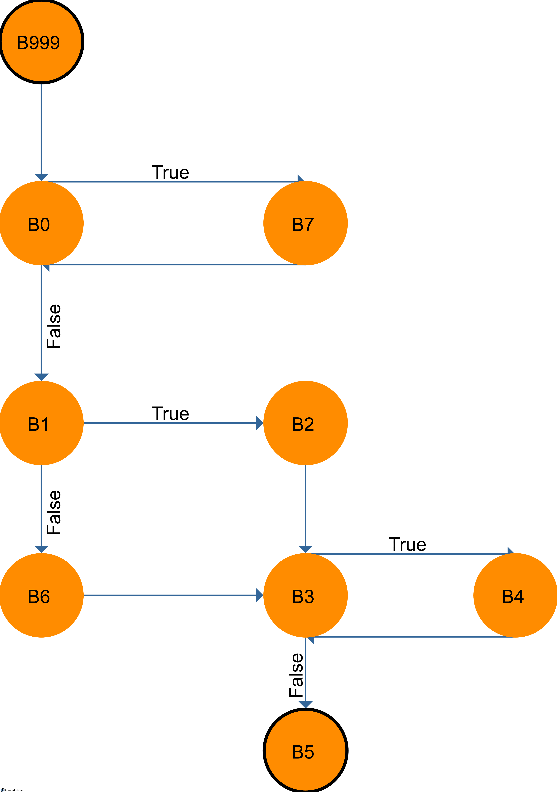

<h1>Strukturální testování - řídicí tok</h1>
Skupina: <strong>10</strong>

Řešitelé: <strong>Stanke Michal</strong>, <strong>Timr Marek</strong>, <strong>Voříšek Lukáš</strong>

<h2>Zadání úlohy</h2>

Následující zdrojový Java kód funkce převeďte na graf řídicího toku. Metodou
hlavních cest sestrojte sadu testovacích cest, které plně pokryjí daný kód.

<pre>
public int fnc() {
  B999();
  while( B0() ) {
    B7();
  }
  if( B1() ) then {
    B2();
  }
  else {
    B6();
  }
  while( B3() ) {
    B4();
  }
  B5();
}
</pre>

  
  obrázek 1 - Model řídícího toku

