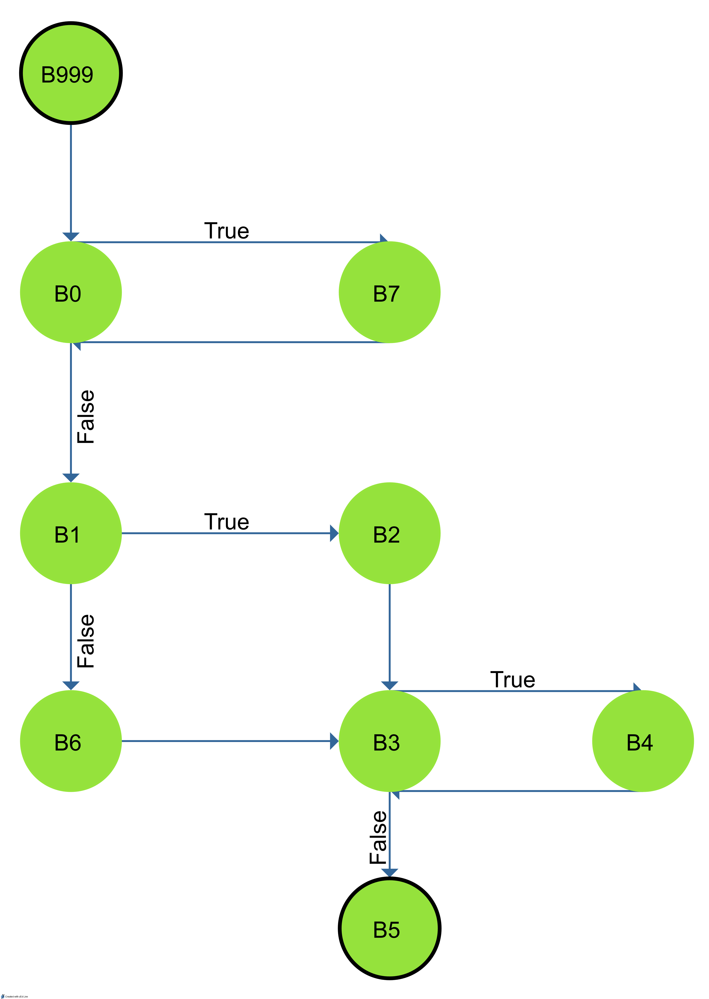

<h1>Strukturální testování - řídicí tok</h1>
Skupina: <strong>10</strong>

Řešitelé: <strong>Stanke Michal</strong>, <strong>Timr Marek</strong>, <strong>Voříšek Lukáš</strong>

<h2>Zadání úlohy</h2>

Následující zdrojový Java kód funkce převeďte na graf řídicího toku. Metodou
hlavních cest sestrojte sadu testovacích cest, které plně pokryjí daný kód.

<pre>
public int fnc() {
  B999();
  while( B0() ) {
    B7();
  }
  if( B1() ) then {
    B2();
  }
  else {
    B6();
  }
  while( B3() ) {
    B4();
  }
  B5();
}
</pre>

  
  obrázek 1 - Model řídícího toku

<h2>Hledání hlavních cest</h2>
TODO: bud vysvetlit vykricniky a hvezdicky nebo to nejak jinak formatovat
<h6>Cesty délky 1</h6>
<ul>  
<li>999</li>
<li>0</li>
<li>1</li>
<li>2</li>
<li>3</li>
<li>4</li>
<li>5!</li>
<li>6</li>
<li>7</li>
<ul>

<h6>Cesty délky 2</h6>
<ul>
<li>999->0</li>
<li>0->1</li>
<li>0->7</li>
<li>1->2</li>
<li>1->6</li>
<li>2->3</li>
<li>3->4</li>
<li>3->5!</li>
<li>4->3</li>
<li>6->3</li>
<li>7->0</li>
</ul>

<h6>Cesty délky 3</h6>
<ul>
<li>999->0->1</li>
<li>999->0->7!</li>
<li>0->1->2</li>
<li>0->1->6</li>
<li>0->7->0*</li>
<li>1->2->3</li>
<li>1->6->3</li>
<li>2->3->4!</li>
<li>2->3->5!</li>
<li>3->4->3*</li>
<li>4->3->4*</li>
<li>4->3->5!</li>
<li>6->3->4!</li>
<li>6->3->5!</li>
<li>7->0->1</li>
<li>7->0->7*</li>
</ul>

<h6>Cesty délky 4</h6>
<ul>
<li>999->0->1->2</li>
<li>999->0->1->6</li>
<li>0->1->2->3</li>
<li>0->1->6->3</li>
<li>1->2->3->4!</li>
<li>1->2->3->5!</li>
<li>1->6->3->4!</li>
<li>1->6->3->5!</li>
<li>7->0->1->2</li>
<li>7->0->1->6</li>
</ul>

<h6>Cesty délky 5</h6>
<ul>
<li>999->0->1->2->3</li>
<li>999->0->1->6->3</li>
<li>0->1->2->3->4!</li>
<li>0->1->2->3->5!</li>
<li>0->1->6->3->4!</li>
<li>0->1->6->3->5!</li>
<li>7->0->1->2->5</li>
<li>7->0->1->6->3</li>
</ul>

<h6>Cesty délky 6</h6>
<ul>
<li>999->0->1->2->3->4!</li>
<li>999->0->1->2->3->5!</li>
<li>999->0->1->6->3->4!</li>
<li>999->0->1->6->3->5!</li>
<li>7->0->1->2->5->4!</li>
<li>7->0->1->2->5->5!</li>
<li>7->0->1->6->3->4!</li>
<li>7->0->1->6->3->5!</li>
</ul>

<h2>Hlavní cesty</h2>
<h5>Nalezené hlavní cesty</h5>
<ol>
<li>B5!</li>
<li>B3->B5!</li>
<li>B999->B0->B7!</li>
<li>B0->B7->B0*</li>
<li>B2->B3->B4!</li>
<li>B2->B3->B5!</li>
<li>B3->B4->B3*</li>
<li>B4->B3->B4*</li>
<li>B4->B3->B5!</li>
<li>B6->B3->B4!</li>
<li>B6->B3->B5!</li>
<li>B1->B2->B3->B4!</li>
<li>B1->B2->B3->B5!</li>
<li>B1->B6->B3->B4!</li>
<li>B1->B6->B3->B5!</li>
<li>B0->B1->B2->B3->B4!</li>
<li>B0->B1->B2->B3->B5!</li>
<li>B0->B1->B6->B3->B4!</li>
<li>B0->B1->B6->B3->B5!</li>
<li>B999->B0->B1->B2->B3->B4!</li>
<li>B999->B0->B1->B2->B3->B5!</li>
<li>B999->B0->B1->B6->B3->B4!</li>
<li>B999->B0->B1->B6->B3->B5!</li>
<li>B7->B0->B1->B2->B5->B4!</li>
<li>B7->B0->B1->B2->B5->B5!</li>
<li>B7->B0->B1->B6->B3->B4!</li>
<li>B7->B0->B1->B6->B3->B5!</li>
</ol>

<h2>Hlavní cesty</h2>

Z následující tabulky byly vynechány všechny takové cesty, které byly podcestou jiné cesty

<table style="margin:0px auto">
	<thead style="">
		<th style="text-align: right">Id cesty</th>
		<th style="text-align: right">Hlavní cesty:</th>
	</thead>
	<tr style="">
		<th style="text-align: right">1</th>
		<td style="text-align: left;">999->0->7!</td>
	</td>
	<tr style="">
		<th style="text-align: right">2</th>
		<td style="text-align: left;">0->7->0*</td>
	</td>
	<tr style="">
		<th style="text-align: right">3</th>
		<td style="text-align: left;">3->4->3*</td>
	</td>
	<tr style="">
		<th style="text-align: right">4</th>
		<td style="text-align: left;">4->3->4*</td>
	</td>
	<tr style="">
		<th style="text-align: right">5</th>
		<td style="text-align: left;">4->3->5!</td>
	</td>
	<tr style="">
		<th style="text-align: right">6</th>
		<td style="text-align: left;">999->0->1->2->3->4!</td>
	</td>
	<tr style="">
		<th style="text-align: right">7</th>
		<td style="text-align: left;">999->0->1->2->3->5!</td>
	</td>
	<tr style="">
		<th style="text-align: right">8</th>
		<td style="text-align: left;">999->0->1->6->3->4!</td>
	</td>
	<tr style="">
		<th style="text-align: right">9</th>
		<td style="text-align: left;">999->0->1->6->3->5!</td>
	</td>
	<tr style="">
		<th style="text-align: right">10</th>
		<td style="text-align: left;">7->0->1->2->5->4!</td>
	</td>
	<tr style="">
		<th style="text-align: right">11</th>
		<td style="text-align: left;">7->0->1->2->5->5!</td>
	</td>
	<tr style="">
		<th style="text-align: right">12</th>
		<td style="text-align: left;">7->0->1->6->3->4!</td>
	</td>
	<tr style="">
		<th style="text-align: right">13</th>
		<td style="text-align: left;">7->0->1->6->3->5!</td>
	</td>
</table>

<h2>Testovací cesty</h2>
<table style="margin:0px auto">
	<thead style="">
		<th style="text-align: right">Označení testovací cesty (z jakých hlavních cest byla složena):</th>
		<th style="text-align: right">Testovací cesta:</th>
	</thead>
	<tr style="">
		<th style="text-align: right">7</th>
		<td style="text-align: left;">999->0->1->2->3->5!</td>
	</td>
	<tr style="">
		<th style="text-align: right">9</th>
		<td style="text-align: left;">999->0->1->6->3->5!</td>
	</td>
	<tr style="">
		<th style="text-align: right">6+3+5</th>
		<td style="text-align: left;">999->0->1->2->3->4->3->5!</td>
	</td>
	<tr style="">
		<th style="text-align: right">8+5</th>
		<td style="text-align: left;">999->0->1->6->3->4->3->5!</td>
	</td>
	<tr style="">
		<th style="text-align: right">1+2+11</th>
		<td style="text-align: left;">999->0->7->0->1->2->5->5!</td>
	</td>
  <tr style="">
		<th style="text-align: right">1+2+11</th>
		<td style="text-align: left;">999->0->7->0->1->2->5->5!</td>
	</td>
	<tr style="">
		<th style="text-align: right">1+13</th>
		<td style="text-align: left;">999->0->7->0->1->6->3->5!</td>
	</td>
	<tr style="">
		<th style="text-align: right">1+10+5</th>
		<td style="text-align: left;">999->0->7->0->1->2->5->4->3->5!</td>
	</td>
	<tr style="">
		<th style="text-align: right">1+12+5</th>
		<td style="text-align: left;">999->0->7->0->1->6->3->4->3->5!</td>
	</td>
	<tr style="">
		<th style="text-align: right">6+4+5</th>
		<td style="text-align: left;">999->0->1->2->3->4->3->4->3->5!</td>
	</td>
</table>
