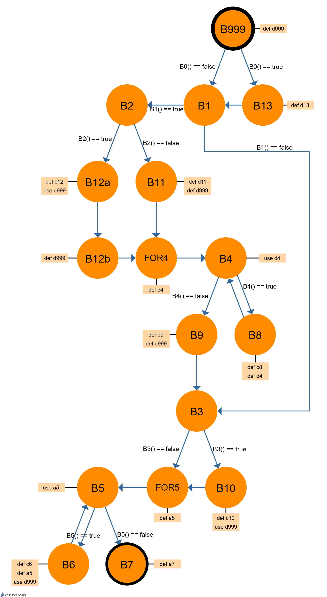

# Strukturální testování - datový tok
Skupina: **10**  
Řešitelé: **Stanke Michal**, **Timr Marek**, **Voříšek Lukáš**

## Zadání úlohy
Následující zdrojový Java kód funkce převeďte na graf řídicího toku (převáděno na datový tok). Nalezněte
du-cesty pro vybranou proměnnou ?999.

<table class="no-padding">
<tr>
<td>B999</td>
<td>
<pre style="font-size: .8em">
public int fnc() {
	B999();
	int d999 = 360;
	if( B0() ) then {
</pre>
</td>
</tr>
<tr>
<td>B13</td>
<td>
<pre style="font-size: .8em">
		B13();
		int c13 = 299;
	}
</pre>
</td>
</tr>
<tr>
<td>B1</td>
<td>
<pre style="font-size: .8em">
	if( B1() ) then {
</pre>
</td>
</tr>
<tr>
<td>B2</td>
<td>
<pre style="font-size: .8em">
		if( B2() ) then {
</pre>
</td>
</tr>
<tr>
<td>B12a</td>
<td>
<pre style="font-size: .8em">
			B12();
			int c12 = d999;
</pre>
</td>
</tr>
<tr>
<td>B12b</td>
<td>
<pre style="font-size: .8em">
			d999 = 206;
		}
</pre>
</td>
</tr>
<tr>
<td>B11</td>
<td>
<pre style="font-size: .8em">
		else {
			B11();
			int d11 = 996;
			d999 = 133;
		}
</pre>
</td>
</tr>
<tr>
<td>FOR4</td>
<td>
<pre style="font-size: .8em">
		<strong>for(int d4 = 0;</strong> B4(d4); d4++ ) {
</pre>
</td>
</tr>
<tr>
<td>B4</td>
<td>
<pre style="font-size: .8em">
		for(int d4 = 0; <strong>B4(d4);</strong> d4++ ) {
</pre>
</td>
</tr>
<tr>
<td>B8</td>
<td>
<pre style="font-size: .8em">
		for(int d4 = 0; B4(d4); <strong>d4++</strong> ) {
			B8();
			int c8 = 837;
		}
</pre>
</td>
</tr>
<tr>
<td>B9</td>
<td>
<pre style="font-size: .8em">
		B9();
		int b9 = 814;
		d999 = 42;
	}
</pre>
</td>
</tr>
<tr>
<td>B3</td>
<td>
<pre style="font-size: .8em">
	if( B3() ) then {
</pre>
</td>
</tr>
<tr>
<td>B10</td>
<td>
<pre style="font-size: .8em">
		B10();
		int c10 = d999;
	}
</pre>
</td>
</tr>
<tr>
<td>FOR5</td>
<td>
<pre style="font-size: .8em">
	for(<strong>int a5 = 0;</strong> B5(a5); a5++ ) {
</pre>
</td>
</tr>
<tr>
<td>B5</td>
<td>
<pre style="font-size: .8em">
	for(int a5 = 0; <strong>B5(a5);</strong> a5++ ) {
</pre>
</td>
</tr>
<tr>
<td>B6</td>
<td>
<pre style="font-size: .8em">
	for(int a5 = 0; B5(a5); <strong>a5++</strong> ) {
		B6();
		int c6 = d999;
	}
</pre>
</td>
</tr>
<tr>
<td>B7</td>
<td>
<pre style="font-size: .8em">
	B7();
	int a7 = 697;
}
</pre>
</td>
</tr>
</table>

## Převod na graf
Úryvek kódu ze zadání převedeme na graf a to tak, že uzly budou reprezenzovat *vrcholy* grafu a řídící funkce (respektive jejich vyhodnocení) bude představovat hrany grafu.

Pro každý vrchol ještě vedeme záznam definovaných proměnných (klíčové slovo def) a proměnných použitých (klíčové slovo use).

  
  obrázek 1 - Model datového toku

## du-cesty pro proměnnou d999
Du-cesta je vzhledem k proměnné *d999* jednoduchou cestou, která je def-čistá z uzlu ni do uzlu nj

### Cesty du(ni, d999)
Jedná se o cesty vzhledem k proměnné *d999*, které začínají v uzlu *ni*.

<table>
	<thead>
		<tr>
			<th class="first-column">Označení cesty</th>
			<th colspan="10">Cesta</th>
		</tr>
	</thead>
		<tr>
			<td>du(b999, d999)</td>
			<td>b999, b1, b2, b12a</td>
		</tr>
		<tr>
			<td></td>
      <td>b999, b13, b1, b2, b12a</td>
		</tr>
		<tr>
			<td></td>
      <td>b999, b1, b3, b10</td>
		</tr>
		<tr>
			<td></td>
      <td>b999, b13, b1, b3, b10</td>
		</tr>
		<tr>
			<td></td>
      <td>b999, b13, b1, b3, for5, b5, b6</td>
		</tr>
		<tr>
			<td></td>
      <td>b999, b1, b3, b10, for5, b5, b6</td>
		</tr>
		<tr>
			<td></td>
      <td>b999, b13, b1, b3, b10, for5, b5, b6</td>
		</tr>
		<tr>
			<td></td>
      <td>b999, b1, b3, for5, b5, b6, b5, b6</td>
		</tr>
		<tr>
			<td></td>
      <td>b999, b13, b1, b3, for5, b5, b6, b5, b6</td>
		</tr>
		<tr>
			<td></td>
      <td>b999, b1, b3, b10, for5, b5, b6, b5, b6</td>
		</tr>
		<tr>
			<td></td>
      <td>b999, b13, b1, b3, b10, for5, b5, b6, b5, b6</td>
		</tr>
    <!-- next section -->
		<tr>
			<td>du(b11, d999)</td>
      <td colspan="0">prázdná</td>
		</tr>
    <!-- next section -->
		<tr>
			<td>du(b12b, d999)</td>
      <td colspan="0">prázdná</td>
		</tr>
    <!-- next section -->
		<tr>
			<td>du(b9, d999)</td>
      <td>b9, b3, b10</td>
		</tr>
		<tr>
			<td></td>
      <td>b9, b3, b10, for5, b5, b6</td>
		</tr>
		<tr>
			<td></td>
      <td>b9, b3, b10, for5, b5, b6, b5, b6</td>
		</tr>
		<tr>
			<td></td>
      <td>b9, b3, for5, b5, b6</td>
		</tr>
		<tr>
			<td></td>
      <td>b9, b3, for5, b5, b6, b5, b6</td>
		</tr>
	</tbody>
</table>

### Cesty du(ni, nj, d999)
Jedná se o cesty vzhledem k proměnné *d999*, které začínají v uzlu&nbsp;*ni*
a končí v uzlu&nbsp;*nj*.

<table>
	<thead>
		<tr>
			<th class="first-column">Označení cesty</th>
			<th colspan="0">Cesta</th>
		</tr>
  </thead>
  <tbody>
		<tr>
			<td>du(b999, b12a, d999)</td>
      <td>b999, b1, b2, b12a</td>
		</tr>
		<tr>
			<td></td>
      <td>b999, b13, b1, b2, b12a</td>
		</tr>
		<tr>
			<td>du(b999, b10, d999)</td>
      <td>b999, b1, b3, b10</td>
		<Itr>
		<tr>
			<td></td>
      <td>b999, b13, b1, b3, b10</td>
		</tr>
		<tr>
			<td>du(b999, b6, d999)</td>
      <td>b999, b1, b3, for5, b5, b6</td>
		</tr>
		<tr>
			<td></td>
      <td>b999, b13, b1, b3, for5, b5, b6</td>
		</tr>
		<tr>
			<td></td>
      <td>b999, b1, b3, b10, for5, b5, b6</td>
		</tr>
		<tr>
			<td></td>
      <td>b999, b13, b1, b3, b10, for5, b5, b6</td>
		</tr>
		<tr>
			<td></td>
      <td>b999, b1, b3, for5, b5, b6, b5, b6</td>
		</tr>
		<tr>
			<td></td>
      <td>b999, b13, b1, b3, for5, b5, b6, b5, b6</td>
		</tr>
		<tr>
			<td></td>
      <td>b999, b1, b3, b10, for5, b5, b6, b5, b6</td>
		</tr>
		<tr>
			<td></td>
      <td>b999, b13, b1, b3, b10, for5, b5, b6, b5, b6</td>
		</tr>
		<tr>
			<td>du(b9, b10, d999)</td>
      <td>b9, b3, b10</td>
		</tr>
		<tr>
			<td>du(b9, b6, d999)</td>
      <td>b9, b3, b10, for5, b5, b6</td>
		</tr>
		<tr>
			<td></td>
      <td>b9, b3, b10, for5, b5, b6, b5, b6</td>
		</tr>
		<tr>
			<td></td>
      <td>b9, b3, for5, b5, b6, </td>
		</tr>
		<tr>
			<td></td>
      <td>b9, b3, for5, b5, b6, b5, b6</td>
		</tr>
  </tbody>
</table>

### Cesty du(b999, nj, d999)
Cesty od počátečního uzlu *b999* do uzlu *nj*.

<table class="small-padding" style="width: 100%;">
	<thead>
		<tr>
			<th class="first-column">Označení cesty</th>
			<th colspan="15">Cesta</th>
		</tr>
  </thead>
  <tbody>
		<tr>
			<td>du(b999, b12a, d999)</td>
      <td>b999, b1, b2, b12a</td>
		</tr>
		<tr>
			<td></td>
      <td>b999, b13, b1, b2, b12a</td>
		</tr>
		<tr>
			<td>du(b999, b10, d999)</td>
      <td>b999, b1, b3, b10</td>
		</tr>
		<tr>
			<td></td>
      <td>b999, b13, b1, b3, b10</td>
		</tr>
		<tr>
			<td>du(b999, b6, d999)</td>
      <td>b999, b1, b3, for5, b5, b6</td>
		</tr>
    <tr>
      <td></td>
      <td>b999, b13, b1, b3, for5, b5, b6</td>
    </tr>
    <tr>
      <td></td>
      <td>b999, b1, b3, b10, for5, b5, b6</td>
    </tr>
    <tr>
      <td></td>
      <td>b999, b13, b1, b3, b10, for5, b5, b6</td>
    </tr>
    <tr>
      <td></td>
      <td>b999, b1, b3, for5, b5, b6, b5, b6</td>
    </tr>
    <tr>
      <td></td>
      <td>b999, b13, b1, b3, for5, b5, b6, b5, b6</td>
    </tr>
    <tr>
      <td></td>
      <td>b999, b1, b3, b10, for5, b5, b6, b5, b6</td>
    </tr>
    <tr>
      <td></td>
      <td>b999, b13, b1, b3, b10, for5, b5, b6, b5, b6</td>
    </tr>
		<tr>
			<td>du(b9, b10, d999)</td>
      <td>b999, b1, b2, b11, for4, b4, b9, b3, b10</td>
		</tr>
		<tr>
			<td>du(b9, b6, d999)</td>
      <td>b999, b1, b2, b11, for4, b4, b9, b3, b10, for5, b5, b6</td>
		</tr>
    <tr>
      <td></td>
      <td>b999, b1, b2, b11, for4, b4, b9, b3, b10, for5, b5, b6, b5, b6</td>
    </tr>
    <tr>
      <td></td>
      <td>b999, b1, b2, b11, for4, b4, b9, b3, for5, b5, b6</td>
    </tr>
    <tr>
      <td></td>
      <td>b999, b1, b2, b11, for4, b4, b9, b3, for5, b5, b6, b5, b6</td>
    </tr>
  </tbody>
</table>

## Závěr
Pomocí datového toku pro proměnnou d999 jsme zjistili, které cesty obsahují
její definici a použití. Cesty nesmí procházet přes jinou definici *d999*.
Průchodem těchto cest můžeme otestovat chování (datový tok) pro tuto proměnnou.
